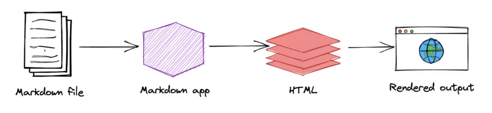

# Hola! Mi nombre es Eva
## Aunque aquí podéis encontrarme como SuaveSeda 👋

**SuaveSeda/SuaveSeda** es mi ✨ primer ✨ repositorio ✨ !!

Actualmente gestiono una herramienta CCaas de telefonía cloud para un contact center, ya llevo varios años trabajando en este área. 
En la gestión de algunas de estas plataformas he utilizado diferentes lenguajes de programación (**Avaya scripts o NiceInContact**) que me permitían configurar algunos detalles para el tratamiento de llamadas inbound. 
También he trabajado con **APIs request** desde las plataformas o usando **Postman e Insomnia**. 
He implementado integraciones con CRM o creación de funcionalidades no incluidas con el uso de **MAKE**.
Y diariamente llevo a cabo consultas SQL y análisis de diferentes KPIs de mi área.

Desde hace ya 2 años combino mi trabajo con los estudios de grado superior de Desarrollo de aplicaciones Web en Barcelona, con ayuda de LinkiaFP en el centro STUCOM.
 
Gracias a este curso he podido practicar **JAVA, HTML, CSS, XML (DTD y XDS)**, también vi en la asignatura de base de datos (**oracle y SQL**).
A lo largo del curso veremos full stack, aunque por el momento creo que me decanto por el área de Frontend.

Aquí voy a dejar algunos de los recursos que me estan sirviendo en mi formación personal (autodidacta).

## Algunos recursos en YouTube:

## Otros recursos:

> Para el diseño de estos enlaces: [Shields.io](https://shields.io/badges/static-badge)

> Este archivo:`README.md` usa Markdown, que es un lenguaje de texto plano, aquí una guía sobre cómo usarlo: [Markdown Guide](https://www.google.com/search?q=markdown+guide&rlz=1C5CHFA_enES1043ES1043&oq=mark&gs_lcrp=EgZjaHJvbWUqDggCEEUYJxg7GIAEGIoFMg4IABBFGCcYOxiABBiKBTIGCAEQRRg5Mg4IAhBFGCcYOxiABBiKBTINCAMQABiDARixAxiABDIKCAQQLhixAxiABDIGCAUQRRg8MgYIBhBFGEEyBggHEEUYPNIBCDMxNzJqMGo3qAIAsAIA&sourceid=chrome&ie=UTF-8).

>> 

